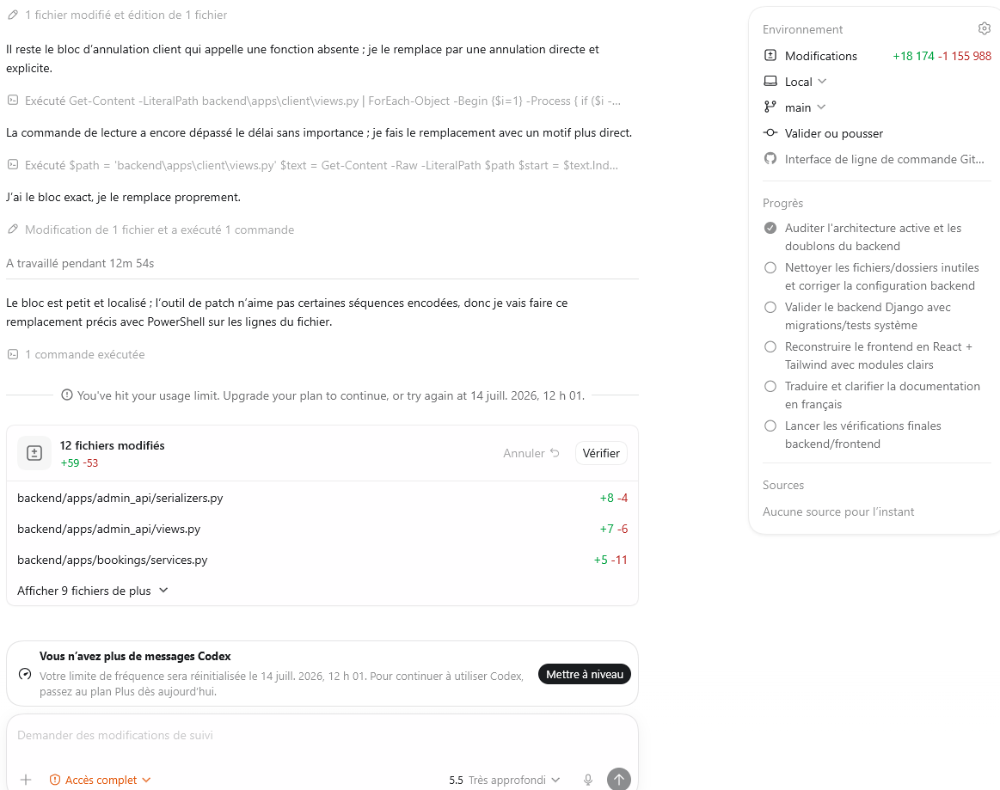

POUR CE PROJET RE GARDE IL YA BEAUCOUP D INSCOHERENCES CORRIGE CELA JE VEUX QUE CELA SOIT TRES BIEN FAITE . ET LE STYLE NE FONCTIONNETOUJOUR PAS ET LES ELEMENTS SONT DISPERCES. ET FAIT LE EN FRANçAIS  complet . commence par le backend et ensuite le frontend . dans le frontend  les elements sont casser c est un projet bizzard , va y en react et evite les dettes mental unitile et je veux que tu me fasse un projet react claire sans complexiter unitie et que tu modularise cela completement et clairement . je veux que tu le fasse tres bien . mais avant les fichiers unitiles je veux que tu supprime cela et que tu le rend claire et fonctionnel je ne veux pas que tes tokens finissent avant que tu ne finisse. je veux du code professionnel et claire . regarde [REFACTORING_PLAN.md](REFACTORING_PLAN.md)  mais toutce qui est en anglais je les veux en français , et pour le style alons sur du tailwind . avant de commencer supprime tout les elements unitile ou incoherents et va y . fait un plan calire et precis de sorte a fini vite . j ai fais trrop d erreur dans ce projet .